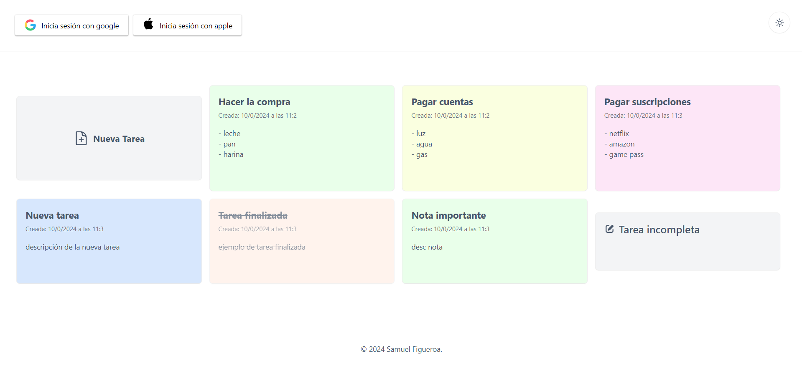
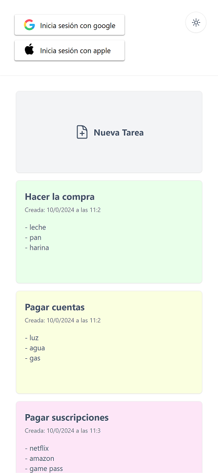
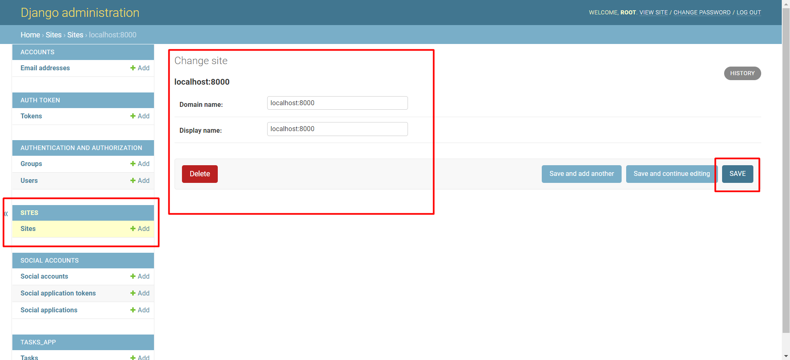
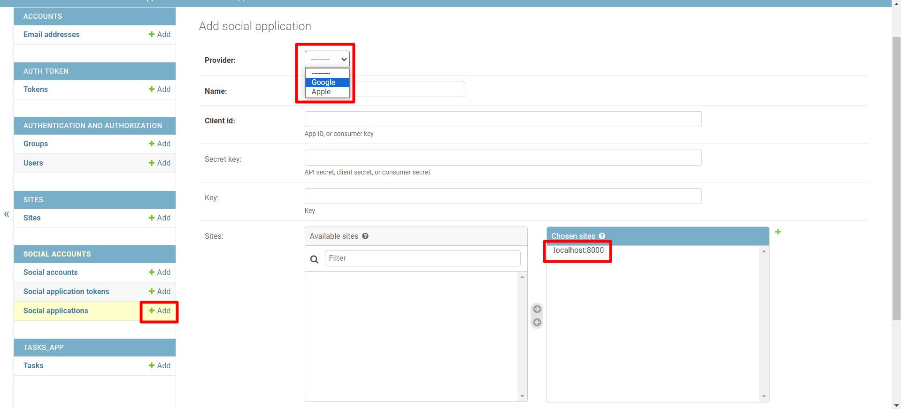
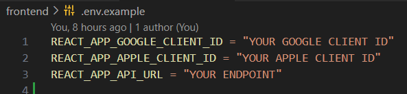

# MyTaskApp

This is an application to create tasks or notes, taking google keep as a reference, it allows you to login with google and apple. It is made with django rest framework and react.

## Screenshot

#### Desktop

#### Mobile

## Requirements

* [Python](https://www.python.org/)
* [Node](https://nodejs.org/)

## Run project

#### Clone this repository

* Execute this where you want to clone the project https

`git clone https://github.com/samuelfs96/MyTasksApp.git`

#### Create project enviroment
* Run this on project root repository:

`python -m venv venv`

* A folder called venv will be created. 

* Run from terminal:

`.\venv\Scripts\activate`

* If an execution policy error is present from PowerShell, just execute this to enable script execution:

`Set-ExecutionPolicy unrestricted`

This will site your terminal on a private  environment for the current project.

* [More info](https://docs.python.org/3/library/venv.html)

#### Install project dependencies

* Run this on root project folder from the private enviroment terminal of previous step

`pip install -r requirements.txt`

#### Setup backend

* Run migrations

`python manage.py migrate`

* Create admin user on django

`python manage.py createsuperuser`

* Run app

`python manage.py runserver`

* Login on django manager

[http://localhost:8000/admin/](http://localhost:8000/admin/)

* Click on sites and setup your site on model, change example site for localhost:8000, like this: 

* Now go to the social apps template and click add, select your provider and add your name, client id and secret key from your google or apple OAuth credentials, and your site localhost:8000, save and repeat for the other provider, something like this: 

#### Setup frontend

* Split a new terminal and run this:

`cd frontend`

* Install app using npm:

`npm install`

* Or using yarn:

`yarn install`

* After install, create a .env file, copy and paste from .env.example and replace values, OAuth credentials and your api url http://localhost:8000 on local

* Run app using npm:

`npm run dev`

* Or using yarn:

`yarn dev`

* Open: 

[http://localhost:5173/](http://localhost:5173/)

## Useful links

- Django admin - [http://localhost:8000/admin/](http://localhost:8000/admin/)
- Api - [http://localhost:8000/tasks/api/v1/](http://localhost:8000/tasks/api/v1/)
- Api documentation - [http://localhost:8000/tasks/docs/](http://localhost:8000/tasks/docs/)
- Frontend - [http://localhost:5173/](http://localhost:5173/)

## Author

- Website - [Samuel Figueroa](https://sfweb.netlify.app/)
